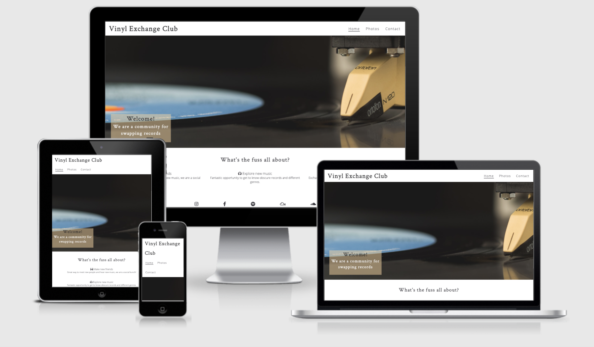
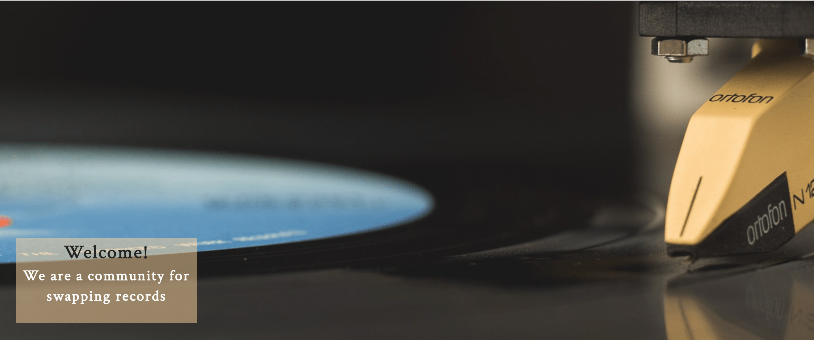
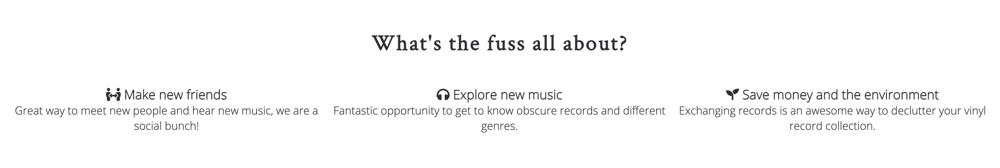
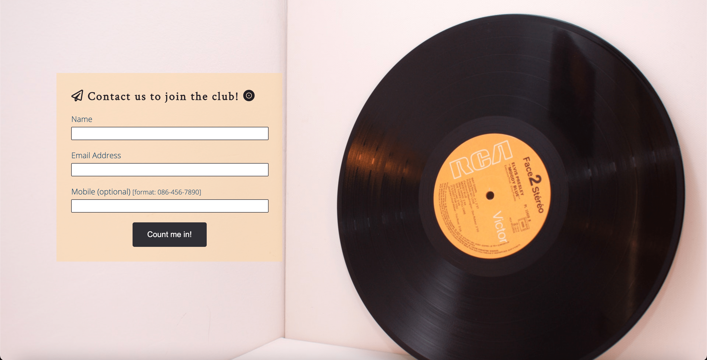
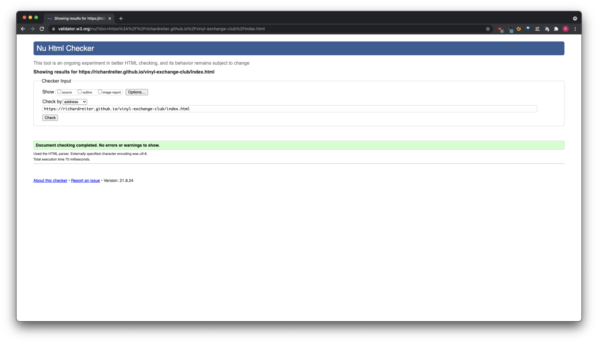
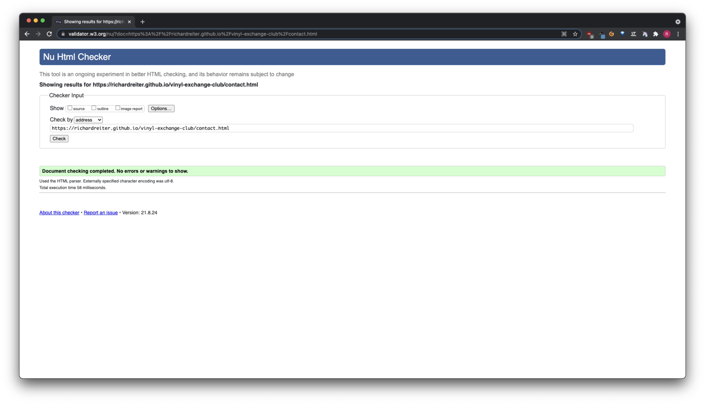

# Vinyl Exchange Club

[Vinyl Exchange Club](https://richardreiter.github.io/vinyl-exchange-club/) is a website dedicated to LP aficionados, who are looking into engaging with other vinyl collectors. The website will be targeted at people who own vinyl records, so these like-minded people can meet, explore new music, genres, artists and bands - all in a sustainable way - swapping their record collection among each other during events/meetups.

Visit the live project [here](https://richardreiter.github.io/vinyl-exchange-club/)

## Features

### Existing Features

- __Navigation Bar__

  - Navigation is a fully responsive feature on all three pages, it includes links on the site's Logo (displaying to the left within the bar), Home, Photos and Contact pages.
  - It looks the same in each page to allow for easy navigation (without the user having to use the ‘back’ button), taking the user through a logical journey.
  - This section makes it easy for the user to learn more about the site's different sections and contents.

- __Hero image/cover text__

  - Landing page/hero image features a picture of a vinyl record and needle, including a cover text overlay to welcome the user and let them know in a sentence what the site is about.

  - It also features a backwards animation aiming to catch the user's attention.

- __Mission/Intentions Section__

  - The mission section is going to clarify to the user the perks/gains of joining the Vinyl Exchange Club community. 
  - This section should inspire the user to contemplate engaging with the site's community, as they could potentially make new friends, hear new music, save money and help the environment, all in a sustainable way.

- __Footer__

  - The footer area consists of five social links of the club (Instagram, Facebook, Spotify, Mixcloud and Soundcloud - all of them if clicked, open on a separate tab).
  - Like the navigation section, the footer looks the same in each page (and features in all of the pages) to allow for easy navigation, taking the user through a logical journey.

- __Photos Page__

  - The photos page features a series of high quality images which can aid the users to have an idea of how the club hang outs are.
  - Users may find this section in particular beneficial, as they will have a visual idea of what the club appears to be and how members engage.

- __Contact Page__

  - The contact page is going to present the user with the opportunity to contact the club to join the Vinyl Exchange Club and hear more about future meetups/events.
  - The contact form features three fields, two mandatory ("Name" and "Email Address") and an optional one ("Mobile"), as well as a submit button.

- __Spotify iFrame__

  - The Spotify iFrame section precedes the footer section on the contact page.

  - This section features an inline frame where the user will have the opportunity to initiate the action of playing music (only if they click on the play button) from the club's Spotify playlist that is embedded.

### Features Left to Implement

- __Hamburger menu__

  - Implementing a hamburger menu/icon for mobile devices would be a positive future addition to perhaps keep in mind, in case the number of pages within the website grow (as in that case the current header navbar might become too busy without a hamburger icon).

- __Forum/Members Area__

  - Implementing a forum/members area in the future could be really beneficial for the Vinyl Exchange Club community, so the users would be able to post vinyl records that they are willing to exchange and also let other users know which records they'd be looking for.

## Testing

### Validator Testing

- HTML
  - No errors/warnings were returned when passing through the official [W3C validator](https://validator.w3.org/nu/?doc=https%3A%2F%2Frichardreiter.github.io%2Fvinyl-exchange-club%2F)

  
  
  

- CSS
  - No errors were found when passing through the official [(Jigsaw) validator](https://jigsaw.w3.org/css-validator/validator?uri=https%3A%2F%2Frichardreiter.github.io%2Fvinyl-exchange-club%2Fassets%2Fcss%2Fstyle.css&profile=css3svg&usermedium=all&warning=1&vextwarning=&lang=en)

  

### Unfixed Bugs

## Deployment

## Credits 

### Content 

### Media