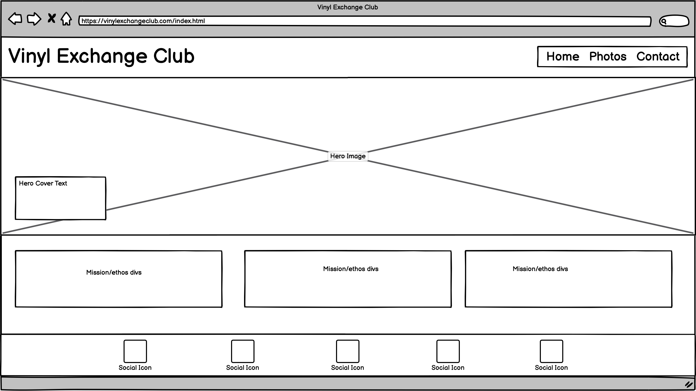
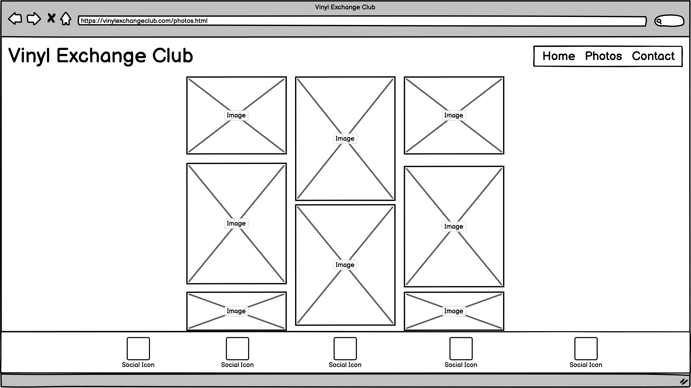
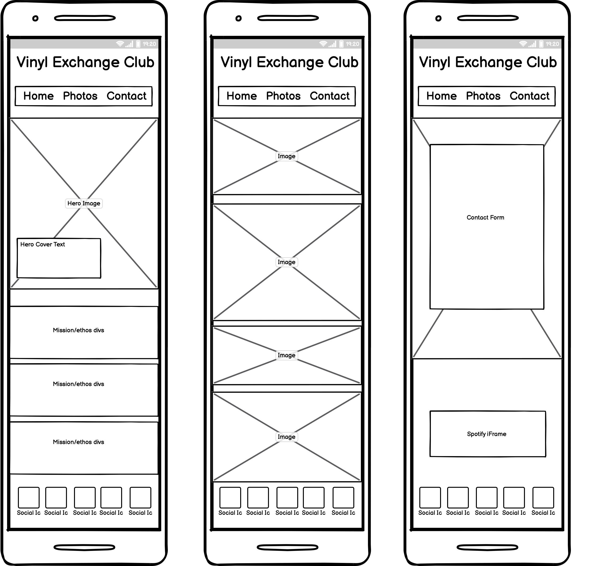
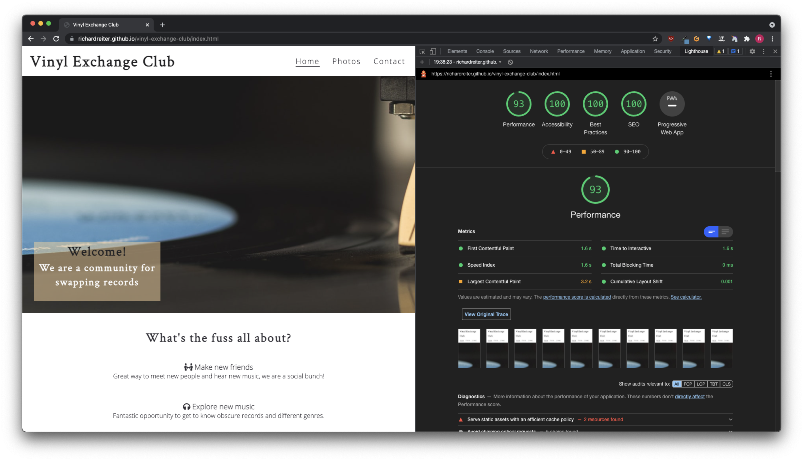
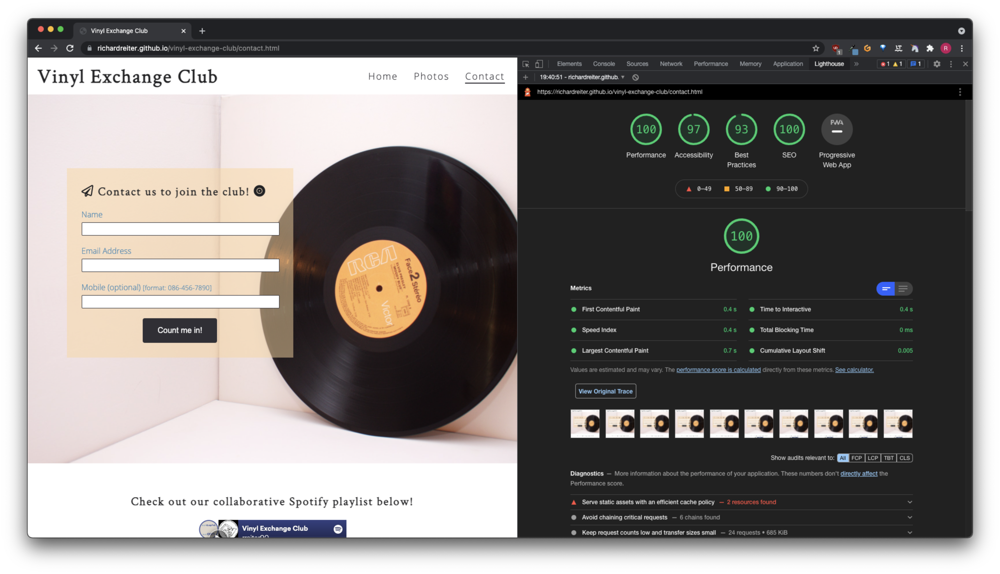
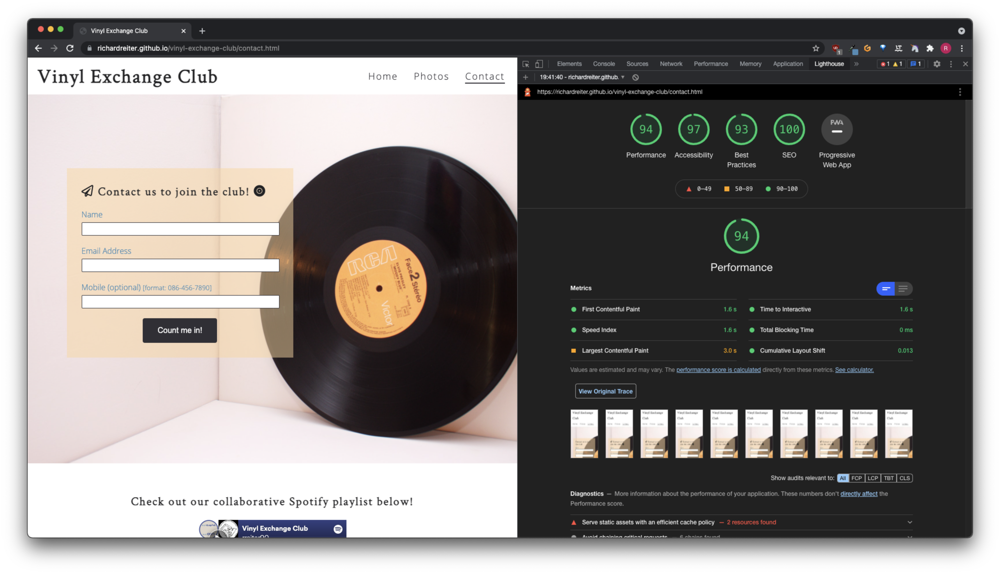
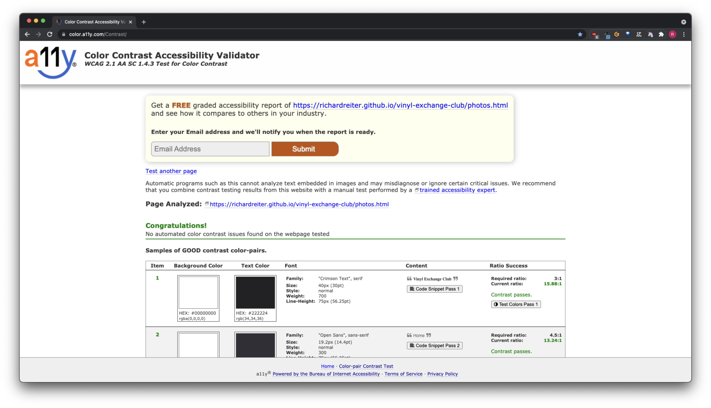
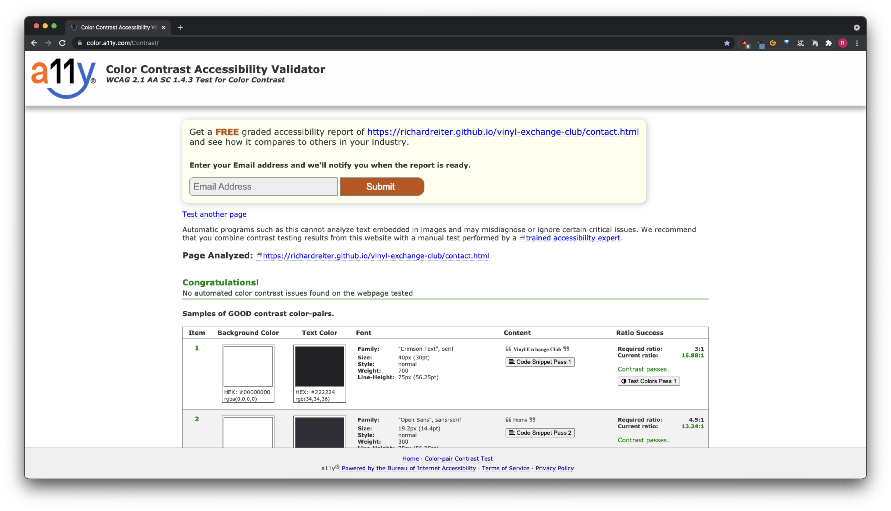

# Vinyl Exchange Club

[Vinyl Exchange Club](https://richardreiter.github.io/vinyl-exchange-club/) is a website dedicated to LP aficionados, who are looking into engaging with other vinyl collectors. The website will be targeted at people who own vinyl records, so these like-minded people can meet, explore new music, genres, artists and bands - all in a sustainable way - swapping their record collection among each other during events/meetups.

Visit the live project [here](https://richardreiter.github.io/vinyl-exchange-club/)

## UX (User Experience)

### Project Goals

- Create a community in which vinyl fans are able to connect with each other and exchange music.
- Provide a sociable and sustainable platform for music fans (through events) so they can grow their collections and potentially make new friends.

### Target Audience

- Anyone who has a vinyl record collection.
- Music fans who want to learn more about vinyl and meet like-minded people.

### Wireframes

The mockups below were done with the help of Balsamiq (for both desktop and mobile screens), these were useful to help visualise the project.

- Desktop:
  - Home page 
  
  - Photos page 
  
  - Contact page
  

- Mobile pages:

## Features

### Existing Features

- __Navigation Bar__

  - Navigation is a fully responsive feature on all three pages, it includes links on the site's Logo (displaying to the left within the bar), Home, Photos and Contact pages.
  - It looks the same in each page to allow for easy navigation (without the user having to use the ‘back’ button), taking the user through a logical journey.
  - This section makes it easy for the user to learn more about the site's different sections and contents.

- __Hero image/cover text__

  - Landing page/hero image features a picture of a vinyl record and needle, including a cover text overlay to welcome the user and let them know in a sentence what the site is about.
  - It also features a backwards animation aiming to catch the user's attention.

- __Mission/Intentions Section__

  - The mission section is going to clarify to the user the perks/gains of joining the Vinyl Exchange Club community. 
  - This section should inspire the user to contemplate engaging with the site's community, as they could potentially make new friends, hear new music, save money and help the environment, all in a sustainable way.

- __Footer__

  - The footer area consists of five social links of the club (Instagram, Facebook, Spotify, Mixcloud and Soundcloud - all of them if clicked, open on a separate tab).
  - Like the navigation section, the footer looks the same in each page (and features in all of the pages) to allow for easy navigation, taking the user through a logical journey.

- __Photos Page__

  - The photos page features a series of high quality images which can aid the users to have an idea of how the club hang outs are.
  - Users may find this section in particular beneficial, as they will have a visual idea of what the club appears to be and how members engage.

- __Contact Page__

  - The contact page is going to present the user with the opportunity to contact the club to join the Vinyl Exchange Club and hear more about future meetups/events.
  - The contact form features three fields, two mandatory ("Name" and "Email Address") and an optional one ("Mobile"), as well as a submit button.

- __Spotify iFrame__

  - The Spotify iFrame section precedes the footer section on the contact page.
  - This section features an inline frame where the user will have the opportunity to initiate the action of playing music (only if they click on the play button) from the club's Spotify playlist that is embedded.

### Features Left to Implement

- __Hamburger menu__

  - Implementing a hamburger menu/icon for mobile devices would be a positive future addition to perhaps keep in mind, in case the number of pages within the website grow (as in that case the current header navbar might become too busy without a hamburger icon).

- __Forum/Members Area__

  - Implementing a forum/members area in the future could be really beneficial for the Vinyl Exchange Club community, so the users would be able to post vinyl records that they are willing to exchange and also let other users know which records they'd be looking for.

## Testing

### Validator Testing

- HTML
  - No errors/warnings were returned when passing through the official [W3C validator](https://validator.w3.org/nu/?doc=https%3A%2F%2Frichardreiter.github.io%2Fvinyl-exchange-club%2F)

  
  
  

- CSS
  - No errors were found when passing through the official [(Jigsaw) validator](https://jigsaw.w3.org/css-validator/validator?uri=https%3A%2F%2Frichardreiter.github.io%2Fvinyl-exchange-club%2Fassets%2Fcss%2Fstyle.css&profile=css3svg&usermedium=all&warning=1&vextwarning=&lang=en)

  

### Google Lighthouse

- Google's Lighthouse was used for measuring the quality of the pages.
  - Index Page (desktop) result:
  

  - Index Page (mobile) result:
  

  - Photos Page (desktop) result:
  

  - Photos Page (mobile) result:
  

  - Contact Page (desktop) result:
  

  - Contact Page (mobile) result:
  

### Color Contrast Accessibility Checker

- [a11y Color Contrast Accessibility Validator](https://color.a11y.com/) was used to analyse the contrast of the pages and make sure it complies with website accessibilities regulations.
  - Index Page result:
  

  - Photos Page result:
  

  - Contact Page result:
  

### Responsive Testing

- __[Am I Responsive?](http://ami.responsivedesign.is/)__
  - This design tool was used to show how responsive the website is and looks across 4 different viewports (Desktop, Laptop, Tablet and Mobile):

### Device Testing

- The Vinyl Exchange Club website was tested on several devices/environments (without any issues), including:
  - MacBook Air 13.3" M1 2020 (macOS Big Sur 11.5.2)
  - Lenovo 5i i5 15" (Windows 10 64x)
  - iPad 8th generation
  - iPhone 6
  - Xiaomi Mi A3 (Android 11)

### Browser Testing

- The Vinyl Exchange Club website was tested on several browsers (without any issues - across different devices), including:
  - Google Chrome (92.0.4515.159 (Official Build) (arm64))
  - Mozilla Firefox (91.0.2 (64-bit))
  - Safari (Version 14.1.2 (16611.3.10.1.6))
  - Microsoft Edge
  - Brave (Version 1.28.106 Chromium: 92.0.4515.159 (Official Build) (arm64))
  - Vivaldi (4.1.2369.21 (Stable channel) (arm64))

### Features Testing

- Navigation bar:
  - The navbar can be found at the top of all pages (common website convention) and is fully responsive on all viewports.
  - All links were tested on every single page by clicking on them (making sure no broken links are found).
  - The menu links are displayed under the logo on tablet/mobile devices.

- Gallery:
  - The photo gallery is fully responsive (the column count for laptop/desktop is three photos, tablets is two pictures and for mobile is one photo).

- Contact Form:
  - The contact form has validation for the email and mobile fields.
  - The submit button sends a post request to Code Institute's form dump (https://formdump.codeinstitute.net/).

- Spotify iFrame:
  - The Spotify iFrame doesn't auto-play music and is fully responsive on all viewports.

- Footer:
  - The footer can be found at the bottom of all pages (common website convention) and is fully responsive on all viewports.
  - All links were tested making sure they are corret and open on a new tab.

### Fixed Bugs

- Footer icons had disappeared from Photos page:
  - I had accidentaly deleted the [Font Awesome](https://fontawesome.com/) kit script from the page's source code, issue was fixed once I implemented the script again (footer icons reappeared).

- Background image disappeared from Contact page once website was deployed:
  - I hadn't noticed I was using an absolute file path as opposed to a relative one for that image in particular, once I deployed the site I couldn't see the contact page's background image, this was fixed once I changed the file path to a relative path.

- iFrame code embbed validation issue:
  - When passing the contact page code through [W3C validator](https://validator.w3.org/nu/?doc=https%3A%2F%2Frichardreiter.github.io%2Fvinyl-exchange-club%2F), initially I had received a few error messages regarding the iFrame code snippet I copied from Spotify, these were fixed once I read the error messages from the validator and removed the width, frameborder and allowtransparency attributes from the code snippet.

- Photos page validation warning:
  - When passing the photos page code through [W3C validator](https://validator.w3.org/nu/?doc=https%3A%2F%2Frichardreiter.github.io%2Fvinyl-exchange-club%2F), initially I had received a warning message "Section lacks heading", this was fixed adding a h2 to the pics section and then setting a style rule to display none.

## Deployment

- The website was deployed to GitHub pages, the steps were: 
  1. Log into my GitHub account.
  2. Select the relevant repository from the far left menu [richardreiter/vinyl-exchange-club](https://github.com/richardreiter/vinyl-exchange-club)
  3. Select the "Settings" option.
  4. Hover down to the GitHub pages section heading.
  5. See the text: "Pages settings now has its own dedicated tab! Check it out here!" (click on "[Check it out here!](https://github.com/richardreiter/vinyl-exchange-club/settings/pages)").
  6. Select "main" under Source Branch.
  7. Click "Save"
  8. A success message appears stating the site has been published at https://richardreiter.github.io/vinyl-exchange-club/

## Credits 

### Content

- The footer icons were taken from [Font Awesome.](https://fontawesome.com/)
- Font inspiration ideas were taken from [this blog post.](https://artisanthemes.io/best-google-fonts-combinations-modern-agency-website/)
- The color scheme was inspired on [this article.](https://designshack.net/articles/trends/best-website-color-schemes/)
- The instructions on [how to fix the navigation bar text aligning backwards](https://stackoverflow.com/questions/32768668/navigation-bar-text-aligning-backwards-css) were taken from [this Stack Overflow post](https://stackoverflow.com/questions/32768668/navigation-bar-text-aligning-backwards-css).
- The instructions on [how to reset/remove the latest Git commit from a repo](https://gist.github.com/CrookedNumber/8964442) were taken from [this Github Gist](https://gist.github.com/CrookedNumber/8964442).
- The instructions on [how to center a form submit button](https://stackoverflow.com/questions/4221263/center-form-submit-buttons-html-css) were taken from [this Stack Overflow post](https://stackoverflow.com/questions/4221263/center-form-submit-buttons-html-css).
- The instructions on [how to fix the iframe showing error on validation](https://stackoverflow.com/questions/11810034/iframe-showing-error-on-validation) were taken from [this Stack Overflow post.](https://stackoverflow.com/questions/11810034/iframe-showing-error-on-validation)
- [This Stack Overflow blog post about best practices for writing code comments](https://stackoverflow.blog/2021/07/05/best-practices-for-writing-code-comments/) inspired me, when leaving code comments/references.
- A huge thank you to Anna Greaves and Code Institute for [the Love Running Walkthrough project](https://github.com/Code-Institute-Solutions/love-running-2.0-sourcecode) which was a great reference, inspiration and example.

### Media

- The home page's [hero image](https://unsplash.com/photos/8lC7p0vq62A) was taken from [Unplash.](https://unsplash.com/)
- All the Photos page gallery images were taken from [Pexels.](https://www.pexels.com/search/vinyl/)
- The [sign up page's background image](https://www.pexels.com/photo/closeup-photo-of-rca-vinyl-record-disc-1300578/) was taken from [Pexels.](https://www.pexels.com/search/vinyl/)
- The contact page's iFrame music player is by [Spotify.](https://spotify.com/)